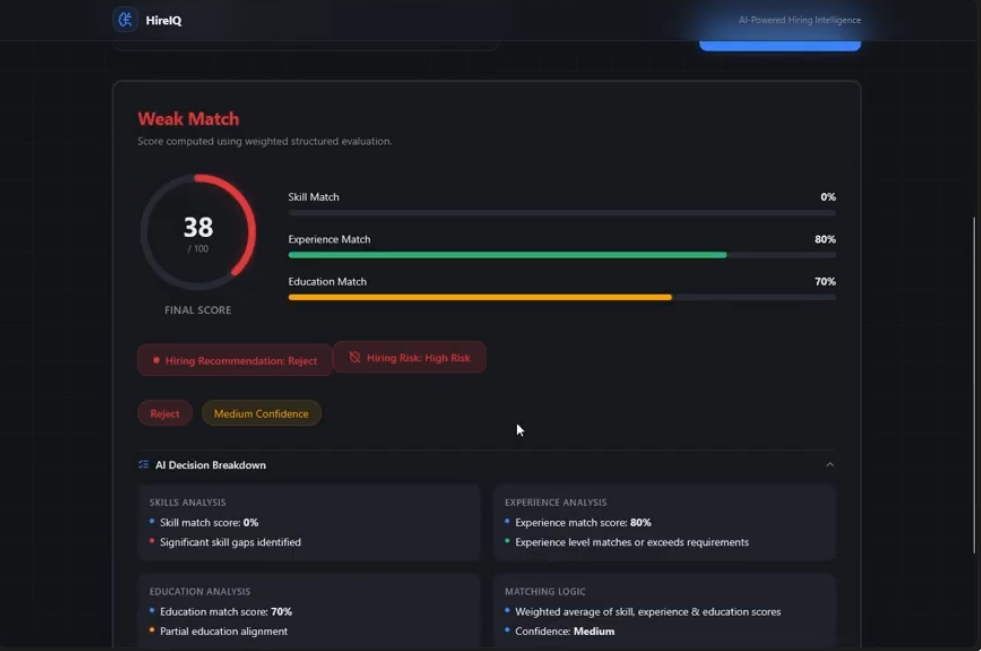

# HireIQ – AI Hiring Co-Pilot (Product Case Study)

## 🚨 Problem
Startups receive high volumes of resumes, making manual screening slow, inconsistent, and difficult to scale.

## 💡 Solution
An AI-powered system that automates resume evaluation and generates consistent candidate scoring.

## ⚙️ Features
- Resume analysis
- Candidate scoring
- Automated workflow

## 🧠 Product Thinking
- Prioritized reducing time-to-hire as the primary success metric  
- Designed for consistency to minimize bias in candidate evaluation  
- Focused on scalability for high-volume hiring scenarios

## 🔍 User Perspective

- Recruiters need faster and more reliable candidate shortlisting  
- Manual processes lead to delays and inconsistent decisions  

## 🛠 Tech Stack
OpenAI API • n8n • Figma • Lovable

## 📊 Outcome
Reduced manual screening effort and improved consistency in candidate evaluation.

## 📸 Screenshots

